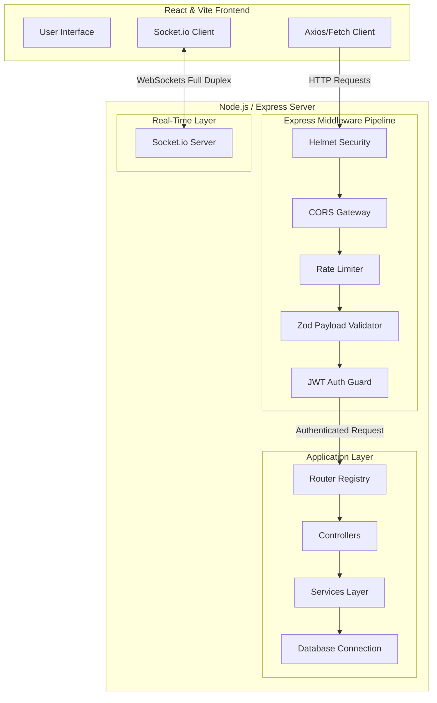

# 💬 ChatApp — Real-time Production-Grade Chat Application

[](https://opensource.org/licenses/MIT)
[](https://nodejs.org/)
[](https://www.typescriptlang.org/)
[](https://expressjs.com/)
[](https://react.dev/)
[](https://vitejs.dev/)
[](https://socket.io/)

ChatApp is a scalable, secure, and production-ready real-time communication platform built on a modern decoupled stack. It features a TypeScript + Express.js REST and WebSocket backend paired with a React + Vite TypeScript frontend.

---

## 🏗️ System Architecture

The following diagram illustrates the workflow of HTTP API requests and real-time WebSocket communication in the ChatApp ecosystem:



---

## 🗂️ Project Directory Structure

The project is structured into two self-contained directories: `frontend` and `backend`.

```
ChatApp/
├── backend/                       # Express + TypeScript Server
│   ├── src/
│   │   ├── config/                # Environment and Client Configuration
│   │   │   ├── db.config.ts       # Database configuration details
│   │   │   └── env.config.ts      # Strict environment validation via Zod
│   │   ├── controllers/           # HTTP controllers parsing requests/responses
│   │   │   ├── auth.controller.ts
│   │   │   └── user.controller.ts
│   │   ├── db/                    # DB connection initializer
│   │   │   └── index.ts
│   │   ├── middleware/            # Custom reusable Express middleware
│   │   │   ├── auth.middleware.ts # JWT authentication guard
│   │   │   ├── error.middleware.ts# Centralized error formatter
│   │   │   ├── rate-limiter.ts    # DDoS prevention limiters
│   │   │   └── validate.ts        # Request payload validators
│   │   ├── routes/                # Route definitions
│   │   │   ├── auth.routes.ts
│   │   │   ├── user.routes.ts
│   │   │   └── index.ts
│   │   ├── services/              # Pure business logic (reusable, testable)
│   │   │   ├── auth.service.ts
│   │   │   ├── socket.service.ts  # WebSockets/Socket.io lifecycle manager
│   │   │   └── user.service.ts
│   │   ├── types/                 # Custom type overrides (e.g. Express Request)
│   │   │   └── index.d.ts
│   │   ├── utils/                 # Utilities and helpers
│   │   │   ├── app-error.ts       # Standardized operational error class
│   │   │   ├── catch-async.ts     # Wrapper to eliminate try-catch boilerplate
│   │   │   └── logger.ts          # Custom Winston logger stream
│   │   ├── app.ts                 # Express setup (CORS, body limits, security)
│   │   └── index.ts               # Entry point (boot, database, sockets, listener)
│   ├── .env.example
│   ├── .gitignore
│   ├── package.json
│   └── tsconfig.json
│
└── frontend/                      # React + TypeScript + Vite Client
    ├── public/                    # Static assets
    ├── src/                       # Frontend source files
    ├── index.html                 # App HTML skeleton
    ├── package.json               # Frontend dependencies
    ├── vite.config.ts             # Vite configuration
    └── tsconfig.json              # TS configuration for web application
```

---

## 💡 Key Design & Coding Decisions

### 1. Robust Type Safety & Environment Validation
Many production projects fail silently due to misconfigured `.env` variables. Our backend includes a Zod-driven validator ([env.config.ts](file:///e:/ChatApp/backend/src/config/env.config.ts)) which checks all required environment inputs (e.g., matching database schemas and JWT lengths) during application boot, throwing immediately if properties are absent or malformed.

### 2. Operational vs. Programmatic Errors
We distinguish between:
*   **Operational Errors**: Predictable runtime situations (invalid user logins, validation faults, missing files). These are encapsulated in `AppError` and safely returned to clients with clean error messages and statuses.
*   **Programmatic/Unexpected Errors**: Unforeseen bugs (e.g., database connection crash, database indexing errors). In production, these are logged in detail via Winston and masked with generic replies, avoiding stack trace leaks to the client.

### 3. Separation of Concerns (Services, Controllers, Routes)
To maximize unit testability:
*   **Routes** only bind paths, HTTP verbs, payload validators, and authorization middleware.
*   **Controllers** read the request inputs, pass the inputs to the services, and handle HTTP formats. They are wrapped in `catchAsync` to avoid `try-catch` repetition.
*   **Services** hold the database clients and business math. They are completely decoupled from Express `req`/`res` contexts.

### 4. Advanced Production Security
*   **Helmet**: Protects against well-known HTTP vulnerabilities by configuring security headers.
*   **CORS**: Strict configuration of origins and credentials.
*   **Rate Limiter**: Blocks repetitive requests from individual IPs to deter DDoS and automated script spam.
*   **Payload Size Limits**: Limits incoming requests to `10kb` to prevent memory buffer overflows.

---

## 🚀 Getting Started

### 1. Clone & Initialize

```bash
git clone <your-repository-url>
cd ChatApp
```

### 2. Configure the Backend

1. Navigate to the backend directory:
   ```bash
   cd backend
   ```
2. Copy the template variables file:
   ```bash
   cp .env.example .env
   ```
3. Fill out the variables in `.env`:
   ```env
   PORT=5000
   NODE_ENV=development
   DATABASE_URL=mongodb://localhost:27017/chatapp
   JWT_SECRET=super_secret_jwt_sign_key_for_chatapp_auth_production_grade
   JWT_EXPIRES_IN=7d
   CORS_ORIGIN=http://localhost:5173
   ```
4. Install dependencies:
   ```bash
   npm install
   ```
5. Run the server:
   - **Development (hot reloading)**:
     ```bash
     npm run dev
     ```
   - **Build & Run Production**:
     ```bash
     npm run build
     npm run start
     ```

### 3. Configure the Frontend

1. Navigate to the frontend directory:
   ```bash
   cd ../frontend
   ```
2. Install dependencies:
   ```bash
   npm install
   ```
3. Start the dev server:
   ```bash
   npm run dev
   ```

---

## 🔒 Security & Performance Checklist

- [x] **Secure Headers**: Implemented with `helmet`.
- [x] **Rate Limiting**: Configured for `/api` routes via `express-rate-limit`.
- [x] **Payload Limit**: Checked at maximum `10kb` for JSON strings.
- [x] **Environment Auditing**: Powered by Zod validators at startup.
- [x] **JWT Cryptography**: Signed with HMAC SHA256 and configured with customizable timeouts.
- [x] **Structured Logging**: Winston rotation logging for exceptions and Morgan runtime HTTP traces.
- [x] **WS CORS validation**: WebSockets connections audited for origin security alignment.
- [x] **Type Safety**: Strictly checked with `tsc --noEmit` and custom global types.
